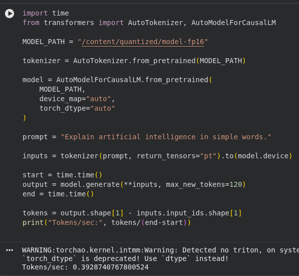
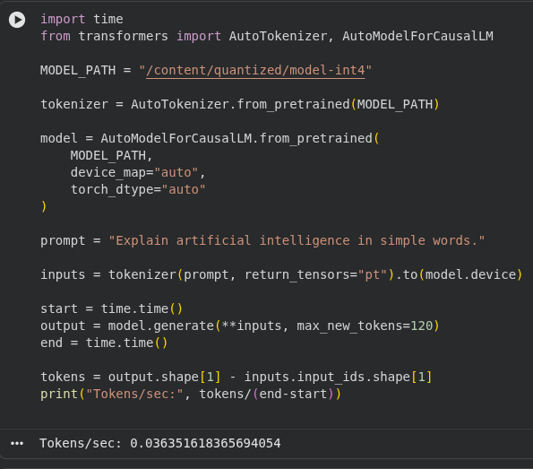
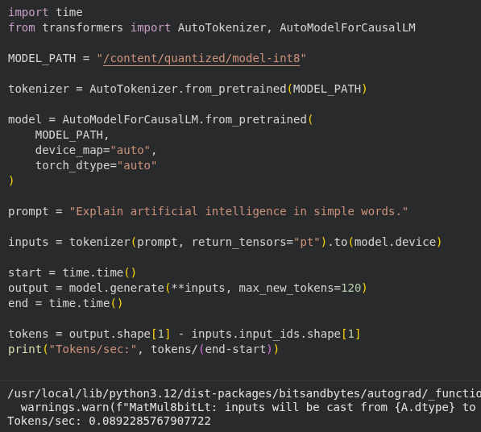
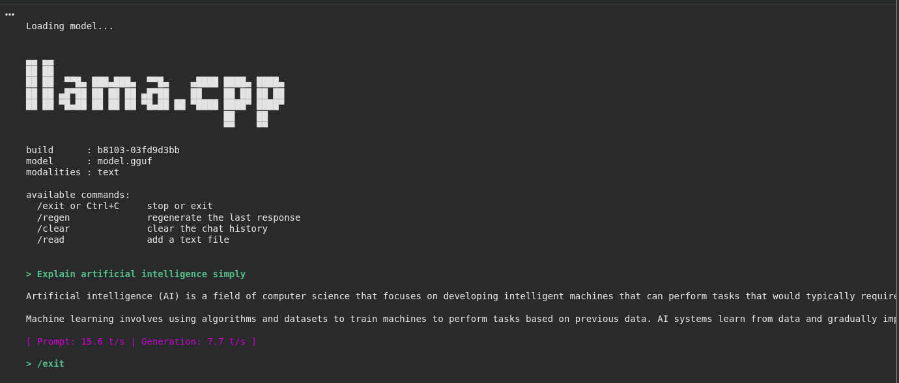

# QUANTISATION REPORT

## 1. Overview

This report describes the quantisation and performance analysis of a fine-tuned
TinyLlama instruction model. Multiple precision formats were generated to
compare memory usage, inference speed, and response quality.

The goal was to optimise the model for efficient deployment while maintaining
acceptable output quality.

All experiments were conducted on a CPU-only Google Colab environment.


Generated formats:

- FP16 (Full Precision Reference)
- INT8 (BitsAndBytes Quantisation)
- INT4 (BitsAndBytes Quantisation)
- GGUF q8_0 (llama.cpp CPU-Optimised Format)

---

## 2. Quantisation Pipeline

The following workflow was used:
```
Fine-tuned FP16 Model
        ↓
INT8 Quantisation (BitsAndBytes)
        ↓
INT4 Quantisation (BitsAndBytes)
        ↓
GGUF Conversion using llama.cpp (q8_0)
```
The GGUF format enables efficient local CPU inference.

---

## 3. Model Locations

| Format | Path |
|---|---|
| FP16 | /quantized/model-fp16 |
| INT8 | /quantized/model-int8 |
| INT4 | /quantized/model-int4 |
| GGUF q8_0 | /quantized/model.gguf |

---

## 4. Format Size Comparison

Disk usage was measured using:

`du -sh /content/quantized/*`

| Format | Size |
|---|---|
| FP16 | 2.1 GB |
| INT8 | 1.2 GB |
| INT4 | 771 MB |
| GGUF q8_0 | 1.1 GB |

### Observations

- FP16 is the largest due to full precision weights.
- INT8 reduces memory significantly while preserving quality.
- INT4 provides the smallest footprint.
- GGUF provides optimized weight layout and efficient CPU execution.


---

## 5. Speed Benchmark (CPU)

### Transformers Inference

| Format | Speed |
|---|---|
| FP16 | 0.39 tokens/sec |
| INT8 | 0.089 tokens/sec |
| INT4 | 0.036 tokens/sec |

### llama.cpp (GGUF)

| Format | Speed |
|---|---|
| GGUF q8_0 | 7.7 tokens/sec |

### Some screenshots that were observed during implementation
- ####  FP16



- #### INT4

 

- #### INT8

 

- #### GGUF (q8_0)




### Observations

- FP16 achieved higher speed than INT8/INT4 on CPU because BitsAndBytes
  quantisation is primarily optimized for GPU execution.
- INT8 and INT4 introduced additional casting overhead during CPU inference.
- GGUF demonstrated significantly faster generation (~20x faster than FP16)
  due to optimized C++ kernels and memory layout in llama.cpp.

---

## 6. Quality Evaluation

Quality was evaluated by generating responses using identical prompts across all formats.

Evaluation Criteria:
- Coherence and readability
- Logical correctness
- Response completeness
- Stability across generations

### FP16
- Highest response consistency
- Most detailed explanations

### INT8
- Output quality very close to FP16
- Minimal degradation observed

### INT4
- Slight reduction in detail for longer responses
- Still usable for general instruction tasks

### GGUF q8_0
- Balanced output quality
- Comparable to INT8 with significantly faster generation speed

---


## 7. GitHub Uploads of Day 3

Some deliverables generated during Day 3 (Quantisation) exceed GitHub’s file
size limitations. Large model artifacts such as the `quantized/` directory are
therefore stored locally and were not uploaded to the repository.

Only the project code, reports, and lightweight files are included in GitHub.

The structure of the local `quantized/` directory is shown below for reference:


```
    quantized/
    ├── model-fp16
    │   ├── chat_template.jinja
    │   ├── config.json
    │   ├── generation_config.json
    │   ├── model.safetensors
    │   ├── special_tokens_map.json
    │   ├── tokenizer_config.json
    │   ├── tokenizer.json
    │   └── tokenizer.model
    ├── model.gguf
    ├── model-int4
    │   ├── config.json
    │   ├── generation_config.json
    │   ├── model.safetensors
    │   ├── special_tokens_map.json
    │   ├── tokenizer_config.json
    │   ├── tokenizer.json
    │   └── tokenizer.model
    └── model-int8
        ├── config.json
        ├── generation_config.json
        ├── model.safetensors
        ├── special_tokens_map.json
        ├── tokenizer_config.json
        ├── tokenizer.json
        └── tokenizer.model
```

These files can be reproduced by running the Day 3 quantisation pipeline(`Day3.ipynb`)
provided in the repository.

---

## 8. Key Insights

1. Quantisation significantly reduces model size while enabling faster inference.
2. INT8 and INT4 are most beneficial when GPU acceleration is available.
3. GGUF is the most efficient format for CPU-based deployment.
4. Choosing the right format depends on the target hardware environment.

---

## 9. Conclusion

The quantisation process successfully produced multiple optimized model formats.

Results show that:

- FP16 provides the best quality baseline.
- INT8 offers strong balance between speed and accuracy.
- INT4 minimizes memory usage.
- GGUF q8_0 provides the best CPU inference performance.

The optimized models are ready for efficient local deployment and benchmarking.
